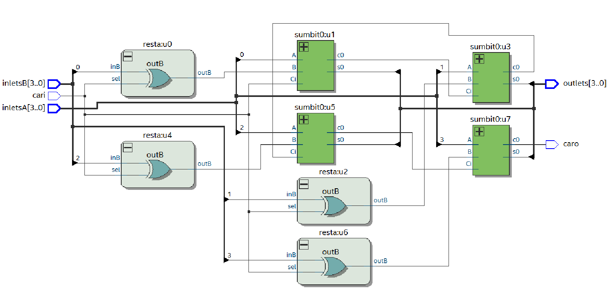
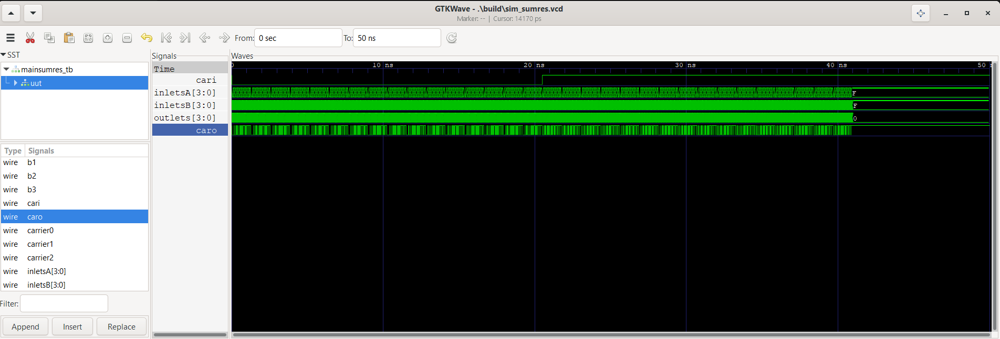
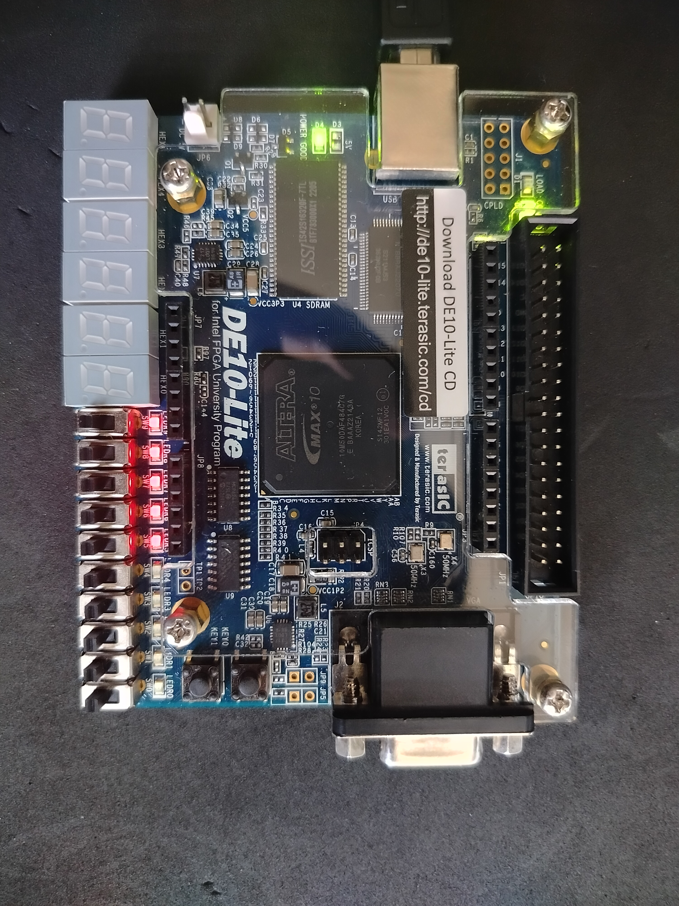

            [](https://classroom.github.com/a/Px-uYaj2)
[](https://classroom.github.com/online_ide?assignment_repo_id=22872255&assignment_repo_type=AssignmentRepo)
# Lab02 - Sumador/Restador de 4 bits

# Integrantes

* [Luis Gil Daza](https://github.com/LuisGilDaza)
* [Diego Alonso Espitia Tacuma](https://github.com/diegoaespitiat-777)

# Informe

Indice:

1. [Documentación](#documentación-de-los-circuitos-implementados-implementado)
2. [Simulaciones](#simulaciones)
3. [Evidencias de implementación](#evidencias-de-implementación)
4. [Preguntas](#preguntas)
5. [Conclusiones](#conclusiones)
6. [Referencias](#referencias)

## Documentación del diseño implementado

La práctica de laboratorio 2 consistió en implementar un circuito digital sumador/restador de 4 bit, usando una FPGA DE10-Lite. En las siguientes subsecciones se describe la manera en que se llevo a cabo la práctica de laboratorio. 

### 1. Sumador/Restador

#### 1.1 Descripción

Para realizar la implementación del circuito digital sumador/restador de 4 bit, fue necesario contar con el trabajo realizado en la práctica de laboratorio sumador completo de 4 bits. Por lo tanto, se usó los códigos generados como parte integral de la librería para poder implementar la presente práctica de laboratorio.

Despues de revisar el contenido de la temático de la práctica de laboratorio se detectó que para el puerto B, se es necesario aplicar conocimientos para realizar la conversión en complemento a 1 y complemento a 2, con el propósito de realizar la suma entre el número del puerto A y el número del puerto B. La manera en que se puede entender esta operación de resta, es similar cuando se desea completar el número con la diferencia que hay entre los dos números. 

De acuerdo con Floyd, Thomas (2000) tanto el complemento a 1 y a 2 permiten representar tambien con mayor facilidad los números negativos. Con base en la guía de laboratorio cuando se aplica un complemento a 2 al número del puerto, B la operacion $A-B$ se reemplaza por $A+(\overline{B}+1)$ donde en la parte final de la expresión se puede observar el complemento a 1 al negar $B$ y luego se convierte a complemento a 2 cuando se suma con 1. Para poder implementar el sumador restdador se hace necesario usar una entrada control "sel" e implementar compuertas XOR.

Se utilizó Visual Studio Code para escribir el módulo resta que incluye la compuerta XOR, la entrada sel de seleccionar entre resta/suma y la salida hacia el sumador de 4 bits. A continuación se muestra el código de descripción de hardware que incluiría la compuerta XOR.

#### Código de restador:
```markdown
```verilog
module resta(
    output outB,
    input inB,
    input sel
);

assign outB = sel^inB;

endmodule
```
Se reusó el código del sumador de 4 bits y se modifica la instancia en el módulo de mayor jerarquia llamado ahora "mainsumres". En él se crearon cuatro cables nuevos llamados $b_0$, $b_1$, $b_2$ y $b_3$, que simplemente conecta la salida de la compuerta XOR a la entrada de cada bit del puerto B del sumador de 4 bits. La instancia del modulo de compuerta XOR recibe el número de entrada del puerto B y la entrada de selección de control "sel" para establcer si el funcionamiento es sumador o restador. A continuacón se muestra el código de la instanciación realizado en el modulo "mainsumres":

#### Código mainsumres:
```markdown
```verilog
module mainsumres(

//Salidas
output wire [3:0]outlets,
output caro,

//Entradas
input wire [3:0]inletsA,
input wire [3:0]inletsB,
input wire cari

);

//Cables para subsistemas

wire carrier0, carrier1, carrier2;

wire b0, b1, b2, b3;


//Low-Level Module Istantiation

resta u0(
    //Salidas
    .outB(b0),
    // Entradas
    .sel(cari),
    .inB(inletsB[0])
);

sumbit0 u1(
    // salidas
    .s0(outlets[0]), //primero es el terminal de sumbit0(terminal main sys)
    .c0(carrier0),
    //entradas
    .A(inletsA[0]),
    .B(b0),
    .Ci(cari)
);

resta u2(
    //Salidas
    .outB(b1),
    // Entradas
    .sel(cari),
    .inB(inletsB[1])
);

sumbit0 u3(
    // salidas
    .s0(outlets[1]),
    .c0(carrier1),
    //entradas
    .A(inletsA[1]),
    .B(b1),
    .Ci(carrier0)
);

resta u4(
    //Salidas
    .outB(b2),
    // Entradas
    .sel(cari),
    .inB(inletsB[2])
);

sumbit0 u5(
    // salidas
    .s0(outlets[2]),
    .c0(carrier2),
    //entradas
    .A(inletsA[2]),
    .B(b2),
    .Ci(carrier1)
);

resta u6(
    //Salidas
    .outB(b3),
    // Entradas
    .sel(cari),
    .inB(inletsB[3])
);

sumbit0 u7(
    // salidas
    .s0(outlets[3]),
    .c0(caro),
    //entradas
    .A(inletsA[3]),
    .B(b3),
    .Ci(carrier2)
);

endmodule
```
Despues de haber implementado el código mencionado anteriormente, se procedió a realizar la simulación con test bench, que se puede consultar en la sección simulaciones. 

Luego se implementó el código indicado anteriormente en el software Quartus Lite Edition, donde se creo un proyecto, se seleccionó el FPGA DE10-Lite, se realizo en primera instancia un compilado, luego la asignación de pines para los puertos de entrada A, B, control sel, salida de la suma y signo representado en los leds, confioguración de niveles de voltaje recomendado por el manual del usurio de la FPGA y que es recomendado por el fabricante. Después de haber realizado las configuraciones pertinentes, se compilo y se programó el PFGA para poder llevar a cabo la prueba práctica de funcionamiento del circuito sumador/restador.

#### 1.2 Diagramas

El diagrama de circuito digital para el sumador/restador de 4 bit se muestra en Figura 1. Este diagrama se obtuvo al compilar el código usando el software Quartus Lite Edition.

<p align="center">
  
</p>
<p align="center"><b>Figura 1</b>, Diagrama RTL Sumador/Restador de 4 bits.
</p>

## Simulaciones 

### 1. Simulación del sumador/restador

#### 1.1 Descripción

La simulación del circuito digital sumador/restador de 4 bits se realizó usando visual studio code, GTKwave. Para esto fue necesario implkementar el código que se muestra a continuación:

```markdown
```verilog
`include "mainsumres.v"
`timescale 1ps/1ps

module mainsumres_tb ();

// se crean registros para las salidas con cables

wire [3:0]s_tb;
wire c0_tb;

// se crean registros para las entradas

reg [3:0]A_tb;
reg [3:0]B_tb;
reg Ci_tb;

// se crea la instancia

mainsumres uut(
    .outlets(s_tb),
    .caro(c0_tb),
    .inletsA(A_tb),
    .inletsB(B_tb),
    .cari(Ci_tb)
);

// Se inicializan las entradas
integer i, j, a;

initial begin
    A_tb=4'b0000;
    B_tb=4'b0000;
end

initial begin

// prueba
    for(a=0;a<2;a=a+1)begin
        Ci_tb=a;
        for ( i=0 ;i<256; i=i+1 ) begin
            for (j=0 ;j<16 ;j=j+1 ) begin
            A_tb = i;
            B_tb = j;
            #5; 
            end
        end
    end
end

initial begin: TEST_CASE
    $dumpfile("sim_sumres.vcd");
    $dumpvars(-1, uut);
    #50000; 
    $finish;
end

endmodule
```

La simulación fue realizada bajo el ambiente de "Test-Bench" usando GTKWave.

#### 1.2 Diagrama

El diagrama de la simulación obtenida se muestra en Figura 2, donde se puede apreciar la respuesta de la salida con respecto a las entradas. 

<p align="center">
  
</p>
<p align="center"><b>Figura 2</b>, Simulación del circuito digital sumador/restador de 4 bits implementado en FPGA DE10-Lite.
</p>

Con base en las entradas, se pudo comprobar el correcto funcionamiento del circuito implementado, por lo que permitió avanzar a la fase de la práctica en laboratorio.

## Evidencias de implementación

En Figura 3, se muestra el FPGA programado durante la práctica de laboratorio para el sumador/restador de 4 bits.

<p align="center">
  
</p>
<p align="center"><b>Figura 3</b>, Evidencia de sumador/restador de 4 bits implementado en FPGA DE10-Lite.
</p>

A continuación de muestra el video de la práctica donde se evidencia el funcionamiento del sumador/restador de 4 bits.

https://github.com/user-attachments/assets/4b7b1bcc-3f75-4464-86fd-ea9245225cc5

## Conclusiones

El laboratorio No. 2 consistió en realizar la implementación de un circuito digital sumador/restador de 4 bits, por lo que fue necesario usar los modulos del sumador de 1 bit y de 4 bits respectivamente. A partir de esta fase inicial se procedió a revisar la gúia y con base en ello se implemento unas compuertas XOR que cumplen la función de hacer la conversión de los bits del puerto B en complemento a 1 y luego en complemento a 2, tambien se agregó la entrada de control "sel" que permite operar el circuito sea como sumador o como restador. Basado en el código de sumilación del sumador de 4 bits se implemento la simulación del circuito restador/sumador de la presente práctica y se obtuvieron los resultados obtenidos, permitiendo avanzar a la fase práctica, donde se pudo corroborar el correcto funcionamiento del circuito implementado para el presente laboratorio.

## Referencias

[1] T. L. Floyd, <i>Fundamentos de sistemas digitales</i>, 7.ª ed. Madrid, España: Prentice Hall, 2000.

[2] B. J LaMeres, <i>Introduction to Logic Circuits & Logic Design with Verilog</i>, 1st Ed. Gewerbestrasse, Switzerland: Springer Cham, DOI: https://doi.org/10.1007/978-3-319-53883-9, 2017.
